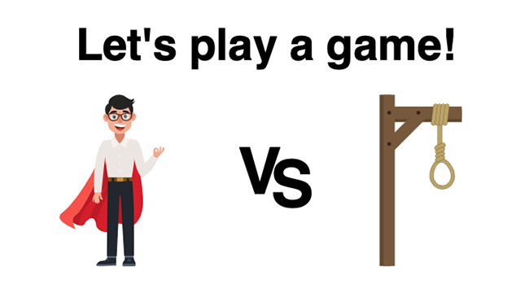

# Hangman

## [**Play here**](https://axelra82.github.io/chas-u03-hangman/)

## About

This game is as simple as they come. You will be given a number of empty lines, where the **objective is** to choose **letters** and **guess** what the **word** is.

### How to

- **Click** on the provided letters
- Or use the letters on your **keyboard**
- Once a letter has been selected it will be **disabled**
- **If your guess was correct** the letter will show instead of the placeholder(s)
  - *No points are deducted for correct guesses*
- **If your guess was wrong** one (1) point will be deducted, i.e. you'll have one less guess before **game over**
- To restart the game press the restart button in the upper right corner

**PS.** Don't bother checking the source code, their are no words in there 😉

### Footnote

A chas academy assignment - u03, Hangman

#### Author

Axel Roussille Åberg @[82 Consulting](https://82con.com)

#### Credits

Character vector graphic designed by [pikisuperstar @Freepik](https://www.freepik.com/free-vector/nice-businessman-character-set_2960917.htm)

Gallow vector graphics from [Vecteezy](https://www.vecteezy.com/vector-art/169206-gallows-vector-icons")

#### Nonsense
**© COPYWRIGHT**, all rights reserved (**or whatever**).  No ropes, keys, keboards, coffee cups, screens, processors, trees or unicorns 🦄 were harmed during the making if this game (**probably**)